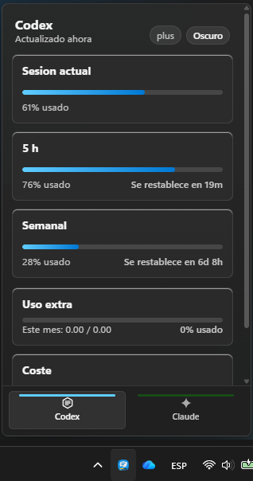
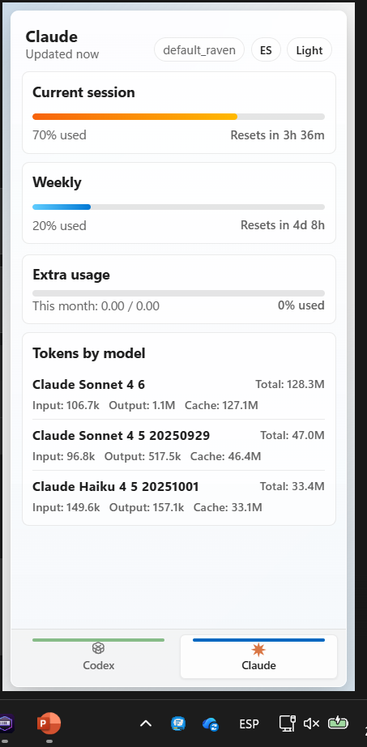

# AgentBar

AgentBar is a Windows tray app built with React and Electron. It shows a compact usage summary for AI agents directly from the system tray.

## Features

- Windows tray popover UI
- Codex usage from local session data
- Claude local token activity by model
- Claude web session reconnect flow
- Light and dark theme
- Spanish and English UI
- Compact dashboard layout for small screens

## Screenshots

| Dark mode | Light mode |
| --- | --- |
|  |  |

## Current support

- `Codex`: local usage and limits from local session data
- `Claude`: local token activity, plus web session support when Claude accepts the saved browser session
- `Gemini`, `Copilot`, `Cursor`: placeholders for future versions

## Requirements

- Node.js 20 or later
- Windows 11 for the system tray experience

## Development

```powershell
npm install
npm run dev
```

The app opens a tray icon. Left click shows the summary; right click opens the action menu.

## Run After Cloning

```powershell
git clone <repo-url>
cd agentbar
npx .
```

`npx .` installs what it needs in the npm cache, builds the UI if `dist/` is missing, and starts the app in the system tray. To run it in the foreground and see logs:

```powershell
npx . --foreground
```

To open the popover immediately at startup:

```powershell
npx . --show
```

## Package

```powershell
npm run build
npm run package
```

Installers are written to `release/`.

## Notes

- Claude web limits depend on the current validity of the saved Claude web session.
- Local runtime state, cookies, and browser sessions are intentionally ignored by Git and are not part of the repository.

## Community

- Contribution guide: [CONTRIBUTING.md](CONTRIBUTING.md)
- Code of conduct: [CODE_OF_CONDUCT.md](CODE_OF_CONDUCT.md)

## License

MIT
